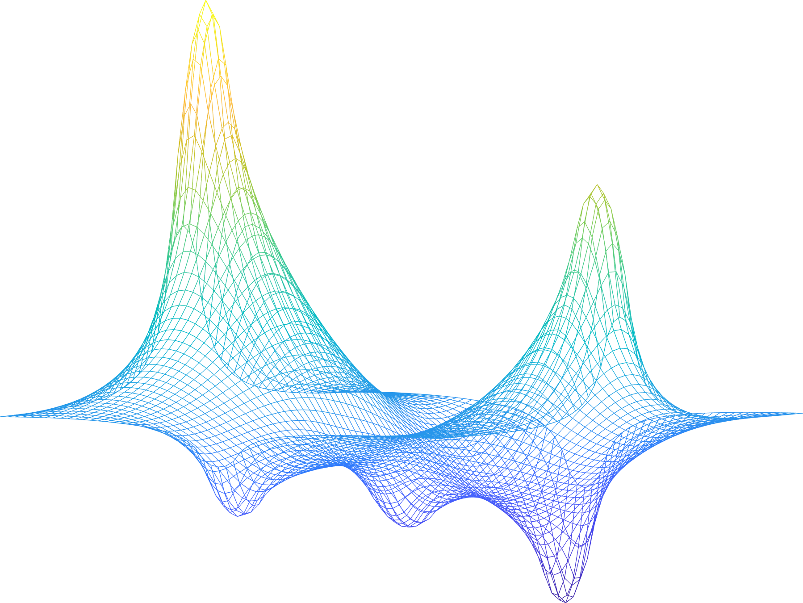

# ROMPC: Reduced Order Model Predictive Control #
This repository provides an implementation of the reduced order model predictive control scheme described in (journal paper)

## Relevant Publications ##
J. Lorenzetti and M. Pavone, [“Error Bounds for Reduced Order Model Predictive Control,”](https://arxiv.org/pdf/1911.12349.pdf) in _Proc. IEEE Conf. on Decision and Control_, Jeju Island, Republic of Korea, 2020. (Submitted)

J. Lorenzetti, B. Landry, S. Singh, and M. Pavone, [“Reduced Order Model Predictive Control For Setpoint Tracking,”](https://arxiv.org/pdf/1811.06590.pdf) in _European Control Conference_, Naples, Italy, 2019.

## Requirements ##
[MATLAB](https://www.mathworks.com/products/matlab.html) 
[MPT3](https://www.mpt3.org/) 
[YALMIP](https://yalmip.github.io/) 
LP/QP solver (e.g [CPLEX](https://www.ibm.com/analytics/cplex-optimizer) or [MOSEK](https://www.mosek.com/)) 

## Example Models ##
The following examples are included in this repository:
| Model                | Description                                                                                                          | Dimension |
|----------------------|----------------------------------------------------------------------------------------------------------------------|:---------:|
| smallSynthetic       | A synthetic discrete-time example                                                                                    |    6      |
| largeSynthetic       | A synthetic discrete-time example                                                                                    |    20     |
| distillationColumn   | A time-discretized model of a binary distillation column [1],[2]                                                     |    86     |
| tubularReactor       | A continuous-time model of a controlled chemical reaction process [3]                                                |    600    |
| heatflow             | A time-discretized model for a distributed control heat flow problem, modified from the HF2D9 model described in [4] |   3,481   |
| supersonicDiffuser   | A time-discretized CFD model for the active control of a supersonic diffuser [5],[6]                                 |  11,730   |
| aircraft             | A continuous-time aircraft dynamics model (with an embedded CFD aerodynamics model) [7],[8]                          |           |

## Notes ##
This repository also contains some open-source code that implements methods that are optionally used when computing the error bounds. In particular, this repository contains:
1. [expmv](https://github.com/higham/expmv) is a MATLAB function that computes the matrix exponential times a vector without explicitly forming the matrix exponential. This technique is based on [9]. ROMPC uses this as an option for computing the matrices used in computing the error bounds in the function recursiveMatExpAction().
2. [HIFOO](https://cs.nyu.edu/overton/software/hifoo/) is a MATLAB package for fixed-order controller design based on nonsmooth, nonconvex optimization. This package is described in [10],[11] and uses the optimization package [HANSO](https://cs.nyu.edu/overton/software/hanso/). In this repository we include a modified version of this package which we refer to as H2SOFO (for H2 Static Output Feedback Optimization). This modified version includes only the funcationality of HIFOO related to optimizing fixed order static (structured) controllers, and additionally includes the ability to consider discrete time problems. This code is used in the function computeControllerGains().

## References ##
[1] S. Skogestad and M. Morari, "Understanding the dynamic behavior of distillation columns", Ind. & Eng. Chem. Research, 27, 10, 1848-1862 (1988) 

[2] S. Skogestad and I. Postlethwaite, "Multivariable Feedback Control", Wiley (1996) 

[3] O. Agudelo and J. Espinosa, "Control of a tubular chemical reactor by means of POD and predictive control techniques", European Control Conference (2007)

[4] F. Leibfritz, "COMPleib: Constrained matrix optimization problem library" (2006)

[5] K. Willcox and G. Lassaux, "Model Reduction of an Actively Controlled Supersonic Diffuser", Dimension Reduction of Large-Scale Systems, 357-361 (2005)

[6] G. Lassaux, "High-Fidelity Reduced-Order Aerodynamic Models: Application to Active Control of Engine Inlets", Master’s Thesis, Massachusetts Institute of Technology (2002)

[7] J. Lorenzetti, A. McClellan, C. Farhat, and M. Pavone, [“UAV Aircraft Carrier Landing Using CFD-Based Model Predictive Control,”](http://asl.stanford.edu/wp-content/papercite-data/pdf/Lorenzetti.McClellan.Farhat.Pavone.AIAA20.pdf) AIAA Scitech Forum, (2020)

[8] A. McClellan, J. Lorenzetti, M. Pavone, and C. Farhat, [“Projection-based Model Order Reduction for Flight Dynamics and Model Predictive Control,"](https://arc.aiaa.org/doi/abs/10.2514/6.2020-1190) AIAA Scitech Forum (2020)

[9] A. Al-Mohy and N. Higham, "Computing the action of the matrix exponential, with an application to exponential integrators" SIAM J. Sci. Comput., 33(2):488--511, (2011)

[10] D. Arzelier, G. Deaconu, S. Gumussoy and D. Henrion. "H2 for HIFOO", International Conference on Control and Optimization with Industrial Applications (2011)

[11] S. Gumussoy, D. Henrion, M. Millstone and M.L. Overton. "Multiobjective Robust Control with HIFOO 2.0", Proceedings of the IFAC Symposium on Robust Control Design (2009)

